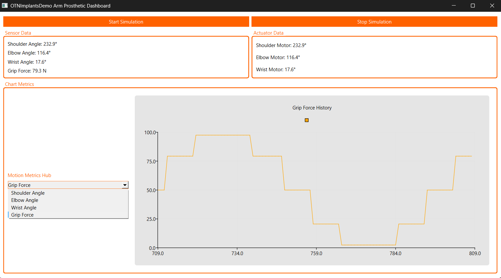

# OTNImplantsDemo

## Overview
`OTNImplantsDemo` is a Qt-based C++ application designed as a demo for OTN Implants, showcasing a dashboard for an arm prosthetic. It simulates sensor and actuator data from an STM32 microcontroller via UART, displaying real-time metrics and charts. 



## Note
- The app uses a simulated UART interface; in a real scenario, `SerialSimulator` will be replaced with `QSerialPort` for STM32 communication.


### Features
- Displays sensor data (shoulder angle, elbow angle, wrist angle, grip force) and actuator data (motor positions).
- Real-time chart visualization with selectable data types (shoulder angle, elbow angle, wrist angle, grip force).
- Start/Stop simulation buttons for controlling data generation.
- Custom-styled UI using Qt stylesheets.
- Built with C++17 and Qt 6.x, targeting Windows (MinGW).

## Project Structure
	OTNImplantsDemo/
	├── main.cpp
	├── SerialSimulator.h
	├── SerialSimulator.cpp
	├── DataProcessor.h
	├── DataProcessor.cpp
	├── Dashboard.h
	├── Dashboard.cpp
	├── OTNImplantsDemo.pro
	├── README.md


## File Descriptions

### `OTNImplantsDemo.pro`
- **Purpose**: Qt project configuration file.
- **Details**: Specifies Qt modules (`core`, `gui`, `charts`, `widgets`), C++17 standard, source/header files, and build settings. Outputs the executable to a `test` subdirectory.

### `main.cpp`
- **Purpose**: Entry point of the application.
- **Details**: Initializes the Qt application, creates instances of `SerialSimulator`, `DataProcessor`, and `Dashboard`, and connects their signals and slots for data flow and UI interaction.

### `SerialSimulator.h`
- **Purpose**: Header file for the `SerialSimulator` class.
- **Details**: Declares a class that simulates UART data packets from an STM32, including methods to start/stop simulation and emit data signals.

### `SerialSimulator.cpp`
- **Purpose**: Implementation of the `SerialSimulator` class.
- **Details**: Generates dummy sensor/actuator data using sine waves, packs it into UART-like packets with checksums, and emits them every 100ms when started.

### `DataProcessor.h`
- **Purpose**: Header file for the `DataProcessor` class.
- **Details**: Defines a class to parse UART packets into `SensorData` and `ActuatorData` structs, with signals to emit processed data.

### `DataProcessor.cpp`
- **Purpose**: Implementation of the `DataProcessor` class.
- **Details**: Validates and unpacks UART packets, converting raw data into meaningful float values for sensors and actuators, then emits them to the dashboard.

### `Dashboard.h`
- **Purpose**: Header file for the `Dashboard` class.
- **Details**: Declares a QWidget-based class for the UI, including public `startButton` and `stopButton`, private UI elements (labels, chart, combo box), and slots for data updates and controls.

### `Dashboard.cpp`
- **Purpose**: Implementation of the `Dashboard` class.
- **Details**: Sets up the UI layout (sensor/actuator sections, chart, buttons, combo box) in C++, applies custom stylesheets, updates labels and charts with incoming data, and handles button/combo box interactions.

## Running Prebuilt binaries
- Navigate to `test/` directory.
- Execute `OTNImplantsDemo.exe`. 


## Building (from source) and Running
1. **Prerequisites**: Qt 6.x with MinGW 64-bit, configured in your environment (tested via Qt 6.8.2 and MSYS2).
2. **Build**:
   - Open a terminal in `OTNImplantsDemo/` or use Qt Creator.
   - Run:
     ```
     qmake6
     make
     ```
3. **Run**:
   - Navigate to `test/` directory.
   - Execute `OTNImplantsDemo.exe`.


